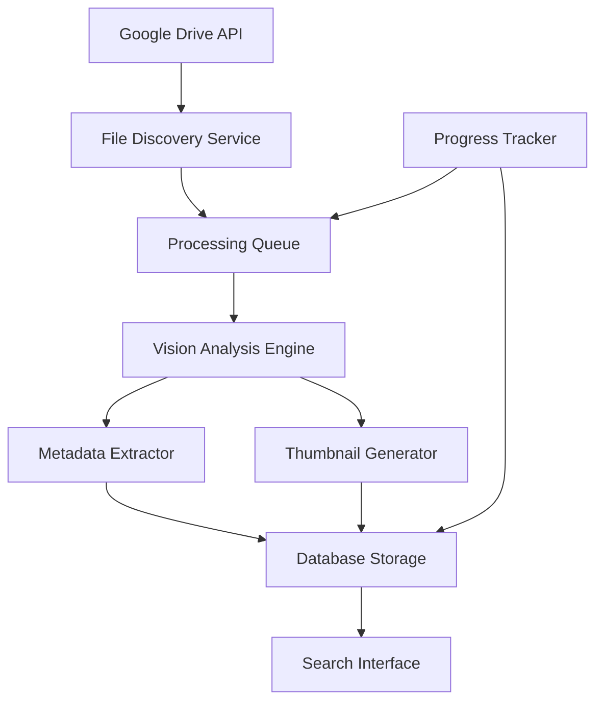

# Design Document

## Overview

The Google Drive Image Processor is a batch processing system that automatically discovers, analyzes, and catalogs media files from Google Drive using local AI vision models. The system follows a pipeline architecture with distinct phases: Discovery → Processing → Storage → Access.

The design prioritizes reliability, resumability, and local control while maintaining simplicity for the initial implementation. All processing occurs locally on macOS using local LLM models, with results stored in a local database for fast querying.

## Architecture

### High-Level Architecture



### Core Components

1. **File Discovery Service**: Traverses Google Drive structure and identifies media files
2. **Processing Queue**: Manages batch processing with state tracking and resumability
3. **Vision Analysis Engine**: Interfaces with local LLM for image analysis
4. **Metadata Extractor**: Structures and validates extracted metadata
5. **Database Storage**: Persists all data with optimized schema
6. **Search Interface**: Provides querying and filtering capabilities
7. **Thumbnail Generator**: Creates and manages image thumbnails

## Components and Interfaces

### File Discovery Service

**Purpose**: Recursively traverse Google Drive and identify all media files

**Key Methods**:
- `discover_files()`: Main entry point for file discovery
- `traverse_folder(folder_id)`: Recursive folder traversal
- `is_media_file(file)`: Determines if file is image/video
- `get_file_metadata(file)`: Extracts basic file information

**Dependencies**: Google Drive API v3

**Output**: List of `MediaFile` objects with basic metadata

### Processing Queue

**Purpose**: Manage batch processing with state persistence and error handling

**Key Methods**:
- `add_files(files)`: Add discovered files to processing queue
- `process_next()`: Process next unprocessed file
- `update_status(file_id, status)`: Update processing status
- `get_failed_files()`: Retrieve files that failed processing
- `resume_processing()`: Continue from last checkpoint

**States**: `pending`, `in_progress`, `completed`, `failed`

### Vision Analysis Engine

**Purpose**: Interface with local LLM for image analysis

**Key Methods**:
- `analyze_image(image_path)`: Send image to LLM for analysis
- `parse_response(llm_response)`: Extract structured data from LLM response
- `validate_metadata(metadata)`: Ensure metadata meets requirements

**LLM Integration**: 
- Uses Gemma-3-4b-it-qat (quantized instruction-tuned model) via LM Studio
- Local API endpoint: http://127.0.0.1:1234
- Optimized for structured JSON outputs with focused prompts
- Temperature setting: 0.3-0.5 for consistent factual outputs
- Retry logic for failed analyses with simplified fallback prompts

### Database Storage

**Purpose**: Persist all metadata with optimized schema for fast querying

**Schema Design**:
```sql
-- Files table: Core file information
CREATE TABLE files (
    id INTEGER PRIMARY KEY,
    drive_file_id TEXT UNIQUE NOT NULL,
    filename TEXT NOT NULL,
    file_path TEXT NOT NULL,
    file_size INTEGER,
    mime_type TEXT,
    created_date TIMESTAMP,
    modified_date TIMESTAMP,
    processing_status TEXT DEFAULT 'pending',
    processed_at TIMESTAMP,
    thumbnail_path TEXT
);

-- Metadata table: AI-extracted metadata for permaculture community
CREATE TABLE metadata (
    id INTEGER PRIMARY KEY,
    file_id INTEGER REFERENCES files(id),
    primary_subject TEXT NOT NULL,
    visual_quality INTEGER CHECK (visual_quality BETWEEN 1 AND 5),
    has_people BOOLEAN,
    people_count TEXT CHECK (people_count IN ('none', '1-2', '3-5', '6-10', '10+')),
    is_indoor BOOLEAN,
    social_media_score INTEGER CHECK (social_media_score BETWEEN 1 AND 5),
    social_media_reason TEXT,
    marketing_score INTEGER CHECK (marketing_score BETWEEN 1 AND 5),
    marketing_use TEXT,
    season TEXT CHECK (season IN ('spring', 'summer', 'fall', 'winter', 'unclear')),
    time_of_day TEXT CHECK (time_of_day IN ('morning', 'midday', 'evening', 'unclear')),
    mood_energy TEXT,
    color_palette TEXT,
    extracted_at TIMESTAMP
);

-- Activity tags table: Predefined permaculture activity categories
CREATE TABLE activity_tags (
    id INTEGER PRIMARY KEY,
    file_id INTEGER REFERENCES files(id),
    tag_name TEXT CHECK (tag_name IN (
        'gardening', 'harvesting', 'education', 'construction', 
        'maintenance', 'cooking', 'celebration', 'children', 
        'animals', 'landscape', 'tools', 'produce'
    ))
);
```

## Data Models

### MediaFile
```python
@dataclass
class MediaFile:
    drive_file_id: str
    filename: str
    file_path: str
    file_size: int
    mime_type: str
    created_date: datetime
    modified_date: datetime
    processing_status: ProcessingStatus = ProcessingStatus.PENDING
```

### ExtractedMetadata
```python
@dataclass
class ExtractedMetadata:
    primary_subject: str
    visual_quality: int  # 1-5 scale
    has_people: bool
    people_count: str  # 'none', '1-2', '3-5', '6-10', '10+'
    social_media_score: int  # 1-5 scale
    social_media_reason: str
    marketing_score: int  # 1-5 scale
    marketing_use: str
    activity_tags: List[str]  # From predefined permaculture categories
    season: Optional[str] = None  # 'spring', 'summer', 'fall', 'winter', 'unclear'
    time_of_day: Optional[str] = None  # 'morning', 'midday', 'evening', 'unclear'
    mood_energy: Optional[str] = None
    color_palette: Optional[str] = None
```

### ProcessingStatus
```python
class ProcessingStatus(Enum):
    PENDING = "pending"
    IN_PROGRESS = "in_progress"
    COMPLETED = "completed"
    FAILED = "failed"
```

## Error Handling

### Google Drive API Errors
- **Rate Limiting**: Implement exponential backoff with jitter
- **Permission Errors**: Log inaccessible folders and continue processing
- **Network Errors**: Retry with circuit breaker pattern
- **Quota Exceeded**: Pause processing and resume after quota reset

### Vision Model Errors
- **Model Unavailable**: Graceful degradation with retry queue
- **Invalid Response**: Log error and mark file for manual review
- **Timeout**: Configurable timeout with retry logic
- **Resource Exhaustion**: Queue management to prevent memory issues

### Database Errors
- **Connection Failures**: Connection pooling with automatic reconnection
- **Constraint Violations**: Data validation before insertion
- **Disk Space**: Monitor storage and alert when approaching limits
- **Corruption**: Regular integrity checks with backup/restore capability

### File System Errors
- **Thumbnail Generation**: Fallback to placeholder thumbnails
- **Disk Space**: Configurable storage limits with cleanup policies
- **Permission Issues**: Graceful handling of read/write restrictions

## Testing Strategy

### Unit Testing
- **File Discovery**: Mock Google Drive API responses
- **Vision Analysis**: Mock LLM responses with known test images
- **Database Operations**: In-memory SQLite for fast test execution
- **Metadata Validation**: Test edge cases and invalid data

### Integration Testing
- **End-to-End Pipeline**: Small test dataset with known expected results
- **Google Drive Integration**: Test folder with controlled content
- **Database Schema**: Migration testing and data integrity validation
- **Error Scenarios**: Simulate various failure conditions

### Performance Testing
- **Batch Processing**: Measure throughput with different batch sizes
- **Database Queries**: Test query performance with large datasets
- **Memory Usage**: Monitor memory consumption during processing
- **Concurrent Operations**: Test system behavior under load

### Test Data Management
- **Sample Images**: Curated set covering various scenarios
- **Expected Metadata**: Ground truth for validation
- **Edge Cases**: Corrupted files, unusual formats, large files
- **Mock Responses**: Consistent test data for reproducible results

## Configuration Management

### Environment Configuration
```yaml
# config.yaml
google_drive:
  credentials_path: "credentials.json"
  root_folder_id: "optional_root_folder"
  batch_size: 100
  rate_limit_delay: 1.0

vision_model:
  model_type: "gemma-3-4b-it-qat"
  api_endpoint: "http://127.0.0.1:1234"
  temperature: 0.4
  max_tokens: 500
  max_retries: 3
  timeout_seconds: 30
  prompt_template: |
    Analyze this image and provide a JSON response with the following information:
    {
      "primary_subject": "Brief description of the main focus (1-2 sentences)",
      "visual_quality": [1-5 scale: 1=blurry/poor, 3=decent, 5=excellent],
      "has_people": true/false,
      "people_count": "none/1-2/3-5/6-10/10+",
      "activity_tags": ["select all that apply: gardening, harvesting, education, construction, maintenance, cooking, celebration, children, animals, landscape, tools, produce"],
      "social_media_score": [1-5 scale],
      "social_media_reason": "One sentence explaining score",
      "marketing_score": [1-5 scale],
      "marketing_use": "best use case for this image"
    }
    Be concise and factual. Focus on what is clearly visible.

database:
  type: "sqlite"
  path: "image_metadata.db"
  backup_enabled: true
  backup_interval_hours: 24

processing:
  thumbnail_size: [200, 200]
  supported_formats: ["jpg", "jpeg", "png", "gif", "bmp", "tiff"]
  max_file_size_mb: 50
  concurrent_workers: 4

logging:
  level: "INFO"
  file_path: "processing.log"
  max_file_size_mb: 10
  backup_count: 5
```

## Deployment Considerations

### Local Development Setup
- Python 3.9+ with virtual environment
- SQLite database (no additional setup required)
- Google Drive API credentials
- Local LLM model installation and configuration

### Dependencies
- `google-api-python-client`: Google Drive API integration
- `Pillow`: Image processing and thumbnail generation
- `sqlite3`: Database operations (built-in)
- `requests`: HTTP client for API calls
- `python-dotenv`: Environment variable management
- `click`: Command-line interface
- `tqdm`: Progress bars for batch operations

### Security Considerations
- Google Drive credentials stored securely (not in version control)
- Database file permissions restricted to user only
- Thumbnail storage with appropriate access controls
- Logging configured to avoid sensitive data exposure

### Monitoring and Observability
- Structured logging with correlation IDs
- Progress tracking with estimated completion times
- Error rate monitoring and alerting
- Resource usage monitoring (CPU, memory, disk)
- Processing statistics and performance metrics